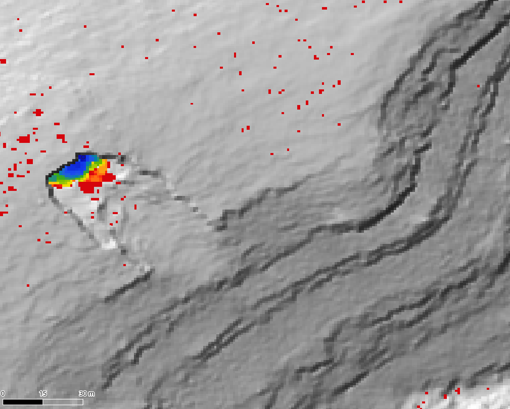
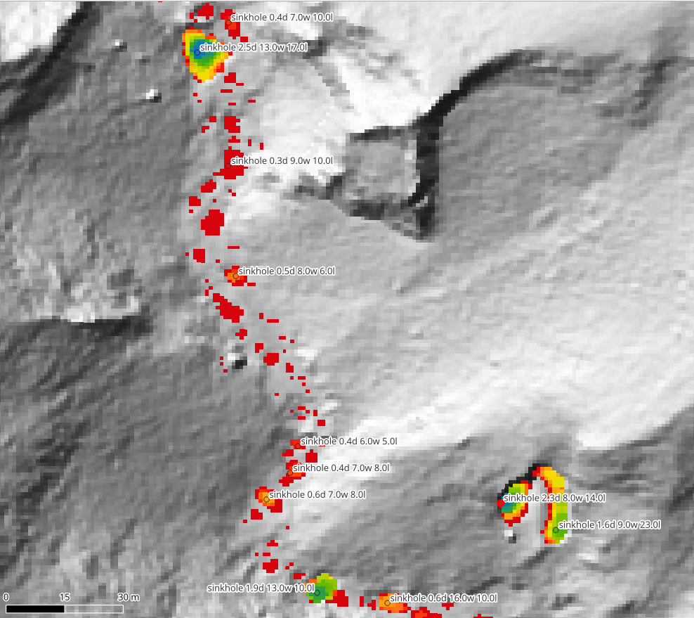
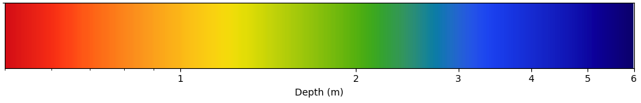
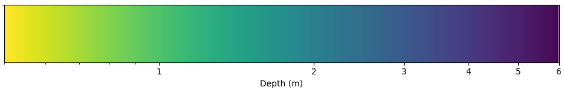

# Automatically extract sinkholes from LIDAR point cloud or DEM data

This tool takes in LIDAR point cloud data, or digital elevation models (DEMs), and extracts sinkholes from this elevation data.
It is primarily intended for use by cavers, to find caves. Closed depressions may be cave entrances, and systematically checking closed depressions in areas with the right geology to have caves is a good way to find caves.

This program automatically extracts sinkholes from DEMs using depression filling algorithms (specifically a modified version of [fast priority-flood by Guiyun Zhou, Zhongxuan Sun, and Suhua Fu](https://www.sciencedirect.com/science/article/abs/pii/S0098300416300553)). It can also input point cloud .las/.laz files and turn them into DEMs (using PDAL). You don't even have to give the program point cloud files: you can give it the coordinates of a bounding box that specify an area you're interested in in the US, and it will automatically download point clouds from the [USGS's GIS data download service](https://www.usgs.gov/the-national-map-data-delivery/gis-data-download).

The program has two primary outputs: hillshade  GeoTIFF maps with sinkholes highlighted and colorcoded by depth, and `.geojson` files listing sinkholes with various statistics such as depth, area, and elevation. The program can automatically add these to a QGIS project you specify, and style layers how you like. This QGIS project can be exported to [QField](https://qfield.org/) and viewed on your phone in the field, which is **extremely useful**.

Above: one sinkhole highlighted and color coded by depth on a hillshade map.

Above: many sinkholes labelled on top of a hillshade map.

# Installation

Right now you have to build from source. The project is written in C++ and requires a C++ compiler. Clone the repository, navigate to the root directory of the repository, and run `make`. The Makefile uses `g++`; it should compile with any other C++ compiler if you change the Makefile.

To use the QGIS integration feature, you'll have to have [QGIS](https://qgis.org/) installed. Download it from the [QGIS website](https://qgis.org/). This program still works without QGIS installed; you just won't be able to use the QGIS integration feature.

You shouldn't have to install any Python beyond what comes installed automatically with QGIS. This program will automatically find and use the Python installation that comes with your QGIS.

# Usage

The `find_sinkholes` program that will be in `bin/` after you compile is the executable. Run it with the following arguments:

 * `-ll`, `--lower-left`. Lower left coordinate of bounding box around your region of interest. LIDAR point clouds from the USGS in this area will be automatically downloaded.
 * `-ur`, `--upper-right`. Upper right coordinate of bounding box around your region of interest. LIDAR point clouds from the USGS in this area will be automatically downloaded.
 * `-pc`, `--point-clouds`. Point cloud files in `.las` or `.laz` format. Use this option instead of the above two flags if you already have the point cloud data you want to use, and don't need to download it from the USGS.
 * `-d`, `--dem`. Input digital elevation models (DEMs) to use. Usually these are in the `.tif` format. Use this option instead of any of the above input options if you already have the DEMs you want to find sinkholes in, and you don't need to create any from point clouds.

All of the above input flags are optional, but you need to specify at least one input file, and you can use all of the above at once. I recommend using the `-ll` and `-ur` options to download point cloud data that will then be automatically turned into DEMs from which sinkholes can be extracted; that's the most convenient if you're just starting out.

 * `-oh`, `--output_hillshade`. Output directory (or .tif file, if there is only one input file) for generated hillshade maps. If you don't specify a filename, it will use the filename from the USGS, with `_hillshade` appended before the extension.
 * `-os`, `--output_sinkholes`. Output directory (or `.geojson` file, if there is only one input file) for generated sinkhole point lists. If you don't specify a filename, it will use the filename from the USGS, swapping `.tif` with `geojson`.

You must specify at least one of the above output options. Below are some optional args.

 * `-q`, `--qgis`. QGIS project file (`.qgz` or `.qgs`) to add generated hillshade maps and sinkholes lists to.
 * `-s`, `--settings`. Settings file. The `settings.json` has all the optional settings and is in the required format.

## Recommended usage for beginners

Start here if you don't know exactly how you want to use this.

First, make a copy of the `qgis_template` folder somewhere and rename `template.qgz` to your liking. Then pick an area that you're interested in finding caves in. I recommend it be no more than about 100 km^2. Get the lower left and upper right coordinates of a bounding box around this area. Run the following command:

`bin/find_sinkholes -ll <lower_left_coordinate_of_bounding_box> -ur <upper_right_coordinate_of_bounding_box> -oh <folder_with_qgis_project> -os <folder_with_qgis_project> -q <folder_with_qgis_project>/<qgis_project_filename.qgz>`

For those outside the US, I don't know what data is generally available. Use point cloud files or DEMs from wherever you can get them.

## A note on colormaps

The default colormap is rainbow_4 (reversed) from [colorcet](https://colorcet.com/gallery.html#rainbow). Rainbow colormaps are not [perceptually uniform](https://programmingdesignsystems.com/color/perceptually-uniform-color-spaces/) and are often not recommended for visualizing depths in 3D scenes like how they are being used here. However, I have chose to use a rainbow colormap anyways, because I care less about the perceptual uniformity of the sinkhole depth visualizations, and more about the visual contrast against the grey background (critical when zoomed way out) and the range of depth values that can be distinguished. Rainbow colormaps are superior to standard perceptually uniform colormaps at those tasks. See below; the rainbow colormap has much more contrast between different depths, although it is less perceptually uniform than colormaps like Viridis. The colormap can be changed to other colormaps in a settings file (which can be applied with a `-s` or `--settings` flag).

Above: rainbow colormap with more contrast and brightness, but less perceptual uniformity.

Above: viridis colormap with less contrast between different depths, and less brightness to stand out against a grey hillshade backgroud. But it's more perceptually uniform, and colorblind-friendly.

The above colormaps have a logarithmic relationship with depth. The colormap, and the parameters of the log scale, can be changed by making a settings file and applying it with `-s` or `--settings`. The default settings file is at `settings.json`.

The currently available colormaps are listed below. All are from the [`matplotlib` colormap library](https://matplotlib.org/stable/users/explain/colors/colormaps.html) unless otherwise noted.
 * `rainbow_4_reverse`, from [colorcet](https://colorcet.com/gallery.html#rainbow).
 * `gist_rainbow`
 * `viridis_reverse`
 * `plasla_reverse`
 * `spring_reverse`
 * `winter_reverse`
 * `cool`

# Included QGIS template

I have included a QGIS project in the `qgis_template` directory. This project file has several layers one will find useful for cave hunting:
 * Google Maps satellite view.
 * Bedrock geology info from [Macrostrat](https://macrostrat.org/).
 * US National Map.
 * OpenStreetMap.

If you have any other GIS layers you like to use when viewing cave-related GIS data, let me know, so I can add them (and so I can use them myself!).
I'd like to add the [USA karst database from the USGS](https://pubs.usgs.gov/of/2014/1156/), [prospects and mines](https://mrdata.usgs.gov/usmin/), and the [Protected Areas Database of the United States (PAD-US)](https://www.sciencebase.gov/catalog/item/65294599d34e44db0e2ed7cf) which is effectively a public land map, but I haven't gotten around to it yet.

# To do list

 * Do something intelligent at the edges of point clouds or DEMs. Stitch them together somehow?
 * A GUI and an installer to make the user experience nicer (just vibe code them).